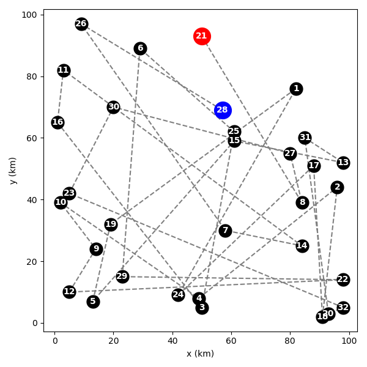
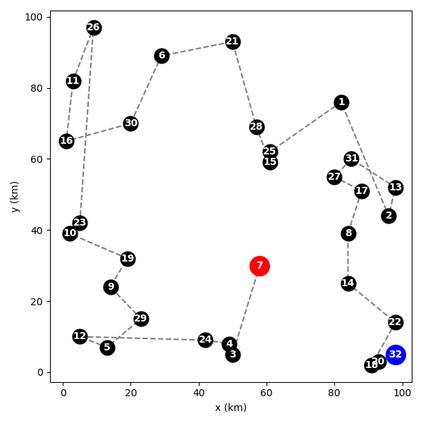

# Traveling salesman challenge

This program reads in a `csv` file containing the x-y coordinates of several points, and chooses a route which visits each point exactly once. Depending on the user's inputs, the route can be randomly generated or picked based on the closest neighbouring points. 

## How to run the program 

From the command line, run the program with the following syntax: 

```
python main.py <options>
```

The options are as follows. 

```
-h, --help
    Show this help text.

-f, --file = <file>
    Path to the CSV file you want to use.
    Required.

-m, --method = <method name> 
    Name of the route-finding method you want to use. 
    Available methods are: 
    - "random"
    - "closest_neighbour"

    Defaults to "random". 

-i, --initial-point = <integer>
    Force the route generation to start from this point. 

-s, --save-figure = <filename.ext>
    Save the plot of the route in current working 
    directory. If no filename is given, "route.png"
    will be used. If no extension is specified, png
    will be used. 
```

### Example

The following command will run the program on `map_c.csv` using the `closest_neighbour` method, starting from point 20, and saving the figure file as `output.png`

```
python main.py -f map_c.csv -m closest_neighbour -i 20 -s output.png
```


## Dependencies

The following built-in python libraries are used in this project: `getopt`, `sys`, `pathlib`, `math`, `random` 

and the following external libraries: `pandas`, `numpy`, `matplotlib`

## Closest_neighbour heuristic

By default, the route between the points is selected randomly. The image below shows a random route on `map_a.csv. ` The blue and red dots are the start and end points, respectively.



This is inefficient. The length of the random routes on `map_a.csv` typically exceed 1800 km. 

As a simple improvement, I have implemented an algorithm which picks the next closest point that hasn't been visited yet: This typically produces route length of around 800 km on `map_a.csv`: 



This is much better than the random route. It is not optimal, however. The algorithm only considers one point at a time, and does not consider the context of the whole route. Consequently, points it chooses to skip early on can result in costly jumps when they are included later. See below; point 21 could have been included between points 6 and 28 at a much lower cost than the jump from point 12.  


