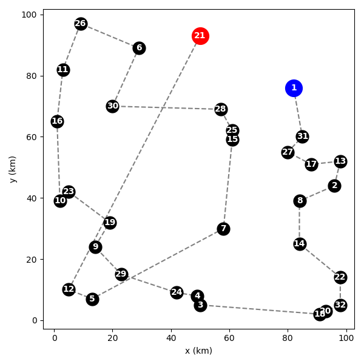

# Traveling salesman challenge

This program reads in a `csv` file containing the x,y coordinates of several points, and chooses a route which visits each point exactly once. Depending on the user's inputs, the route can be randomly generated or picked based on the closest neighbouring points. 

## How to run the program 

From the command line, run the program with the following syntax: 

```
python main.py <options>
```

The options are as follows. 

```
-h, --help
    Show this help text.

-f, --file = <file>
    Path to the CSV file you want to use.
    Required.

-m, --method = <method name> 
    Name of the route-finding method you want to use. 
    Available methods are: 
    - "random"
    - "closest_neighbour"
    - "optimise_route"

    Defaults to "random". 

-i, --initial-point = <integer>
    Force the route generation to start from this point. 

-s, --save-figure = <filename.ext>
    Save the plot of the route in current working 
    directory. If no filename is given, "route.png"
    will be used. If no extension is specified, png
    will be used. 
```

### Example

The following command will run the program on `map_c.csv` using the `closest_neighbour` method, starting from point 20, and saving the figure file as `output.png`

```
python main.py -f map_c.csv -m closest_neighbour -i 20 -s output.png
```

## Dependencies

The following built-in python libraries are used in this project: `getopt`, `sys`, `pathlib`, `math`, `random` 

and the following external libraries: `pandas`, `numpy`, `matplotlib`

## Closest_neighbour heuristic

By default, the route between the points is selected randomly. The image below shows a random route on `map_a.csv. ` The blue and red dots are the start and end points, respectively.


This is inefficient. The length of the random routes on `map_a.csv` typically exceed 1800 km. 

As a simple improvement, I have implemented an algorithm which picks the next closest point that hasn't been visited yet: This typically produces route length of around 800 km on `map_a.csv`: 


This is much better than the random route. It is not optimal, however. The algorithm has a very "local" view; it only considers one point at a time, and does not consider the context of the whole route. Consequently, points it chooses to skip early on because they are slightly out of the way can result in costly jumps when they are included later. See below; point 21 could have been included between points 6 and 28 at a much lower cost than the jump from point 12.  



Because the algorithm calculates the distance from each point to every other point, it is essentially calculating an N by N distance matrix. The computational cost should scale with O(N^2), where N is the number of points. 

Given more time, I would implement an optimisation with the route length as the cost function. 

## Further optimisation

> ***Full disclosure: I have spent way more than 4 hours on the stuff presented below. Feel free to ignore it. If you would like to see the "official" version of this repo, use `git checkout d37e8f4523b29499e453fafcb4f70a9585f3bbb3`***

I have created a new heuristic called `optimise_route` which addresses some of the problems I observed with the `closest_neighbour` heuristic; most notably the large jumps it tends to produce. Since this is clearly a problem with many local optima, I tried to make `optimise_route` less “short-sighted”; I gave it the ability to make global changes to the route. 

`optimise_route` takes an existing route and tries to improve it by removing large jumps. It makes two types of changes: 

- Relocating single points to a different part of the route (a local change to the route)
- Cutting the route and reconnecting the ends (a global change)

### Algorithm

`optimise_route`'s approach can be roughly described as follows: 

1. Find the top N largest jumps in the route (the user can choose N)

2. Cut the route at each of these jumps, giving a list of subroutes

3. Sort the subroutes into "small" and "large" ones

   - A subroute is judged to be "small" if it contains less than some fixed proportion of the total number of points. E.g. `if len(subroute) < proportion*total_number_of_points:  # it is small`
   
4. The "large" subroutes are reconnected in the way which minimises the length of the resulting route

5. The "small" subroutes are broken up into "orphan" points and individually inserted into the route next to one of the 5 nearest points (geographically nearest; not nearest in the route). The orphans are inserted either before or after the chosen point; whichever gives the shortest route 

6. All points on the route are checked and relocated if doing so shortens the route

### Example output 

The `closest_neighbour` algorithm generated the following route on `map_c.csv`. Note the large jumps near the left and bottom edges of the plot. 


After `optimise_route` the route is shorter and no longer contains any large jumps:


It is still probably not optimal, but it has addressed the most obvious weakness of `closest_neighbour`.  